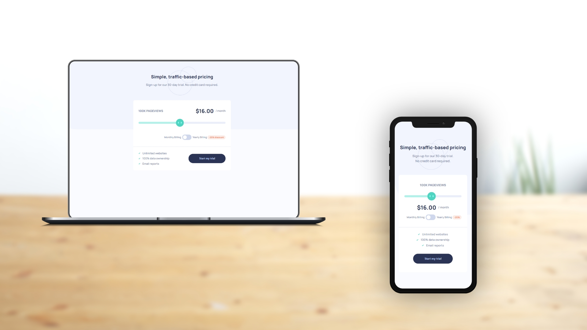

# Interactive pricing component solution

This is a solution to the [Interactive pricing component challenge on Frontend Mentor](https://www.frontendmentor.io/challenges/interactive-pricing-component-t0m8PIyY8). Frontend Mentor challenges help you improve your coding skills by building realistic projects. 

## Table of contents

- [Interactive pricing component solution](#interactive-pricing-component-solution)
  - [Table of contents](#table-of-contents)
  - [Overview](#overview)
    - [The challenge](#the-challenge)
    - [Screenshot](#screenshot)
    - [Links](#links)
  - [Front-end Style Guide](#front-end-style-guide)
    - [Layout](#layout)
    - [Colors](#colors)
    - [Typography](#typography)
    - [Font](#font)
  - [My process](#my-process)
    - [Built with](#built-with)
  - [Author](#author)

## Overview

### The challenge

Users should be able to:

- View the optimal layout for the app depending on their device's screen size
- See hover states for all interactive elements on the page
- Use the slider and toggle to see prices for different page view numbers

### Screenshot

### Links

- Live Site URL: [https://benjaminvillatte.github.io/fem-interactive-pricing-component/](https://benjaminvillatte.github.io/fem-interactive-pricing-component/)

## Front-end Style Guide

### Layout

The designs were created to the following widths:

- Mobile: 375px
- Desktop: 1440px

### Colors

_Primary_

- Soft Cyan (Full Slider Bar): hsl(174, 77%, 80%)
- Strong Cyan (Slider Backround): hsl(174, 86%, 45%)
- Light Grayish Red (Discount Background): hsl(14, 92%, 95%)
- Light Red (Discount Text): hsl(15, 100%, 70%)
- Pale Blue (CTA Text): hsl(226, 100%, 87%)

_Neutral_

- White (Pricing Component Background): hsl(0, 0%, 100%)
- Very Pale Blue (Main Background): hsl(230, 100%, 99%)
- Light Grayish Blue (Empty Slider Bar): hsl(224, 65%, 95%)
- Light Grayish Blue (Toggle Background): hsl(223, 50%, 87%)
- Grayish Blue (Text): hsl(225, 20%, 60%)
- Dark Desaturated Blue (Text & CTA Background): hsl(227, 35%, 25%)

### Typography

- Font size (Introductory Paragraph): 15px

### Font

- Family: [Manrope](https://fonts.google.com/specimen/Manrope)
- Weights: 600, 800
- 
## My process

### Built with

- Semantic HTML5 markup
- CSS custom properties
- Flexbox
- Mobile-first workflow
- Custom Web Components
- Vitejs for hrm and build

## Author

- Website - [Benjamin VILLATTE](https://www.benjaminvillatte.fr)
